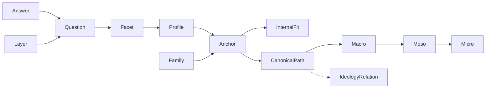

# Domain Dictionary

> Generated 2026-08-29 for the Ideology Layer Sorter. Version v12 (content version 93).

## Core terms

### Layer
- Definition: One of the three claim categories measured by the tool: descriptive, normative, or prescriptive.
- Identifier: `layer`
- UI wording: Layer

### Descriptive
- Definition: A claim about what is true, what causes outcomes, or how systems operate.
- Identifier: `descriptive`
- UI wording: Diagnosis / what is true

### Normative
- Definition: A claim about what is valuable, legitimate, desirable, or worth protecting.
- Identifier: `normative`
- UI wording: Values / what is good

### Prescriptive
- Definition: A claim about what institutions, policies, or strategies should be used.
- Identifier: `prescriptive`
- UI wording: Practice / what to do

### Facet
- Definition: An intermediate concept that receives signals from questions and is compared with anchor profiles.
- Identifier: `facet`
- UI wording: Facet

### Question
- Definition: One original prompt that measures one or more facet effects within a layer.
- Identifier: `question`
- UI wording: Question

### Answer
- Definition: A directional response or explicit no-view state attached to a question ID.
- Identifier: `answer`
- UI wording: Response

### No view
- Definition: The respondent does not have a current view or enough information; it is missing data, not neutrality.
- Identifier: `no-view`
- UI wording: No view yet

### Coverage
- Definition: The proportion of a layer's items with a directional or mixed answer rather than no-view.
- Identifier: `coverage`
- UI wording: Coverage

### Combined pattern
- Definition: An equal-weighted composition of the descriptive, normative, and prescriptive layer proximities, shown only when all three layers meet the coverage threshold; it is not an identity assignment.
- Identifier: `combined-pattern`
- UI wording: Combined pattern

### Measurement gap
- Definition: A required concept or branch distinction that the current facets, questions, and anchors do not represent adequately; it triggers a hold or abstention rather than a forced label.
- Identifier: `measurement-gap`
- UI wording: Measurement gap

### Anchor
- Definition: A manually authored, approximate profile for an interpretive ideological tradition.
- Identifier: `anchor`
- UI wording: Interpretive neighbor

### Family
- Definition: A broad grouping used to prevent a dense taxonomy from dominating the display.
- Identifier: `family`
- UI wording: Family

### Macro ideology
- Definition: A high-level ideological family used as a canonical taxonomy root, such as Liberalism, Socialism, Ecologism, Feminism, or Fascism.
- Identifier: `ideology-level:macro`
- UI wording: Macro family

### Meso tradition
- Definition: A tradition or ideological family inside a macro family, or a parentless cross-family synthesis whose constitutive families are represented by typed relations.
- Identifier: `ideology-level:meso`
- UI wording: Meso tradition

### Micro branch
- Definition: A more specific branch or historical manifestation inside a meso tradition, such as Minarchism inside Libertarianism.
- Identifier: `ideology-level:micro`
- UI wording: Micro branch

### Canonical parent
- Definition: The single breadcrumb relationship used for display and navigation; it does not claim that an ideology has only one intellectual influence.
- Identifier: `canonical-parent-id`
- UI wording: Canonical path

### Ideology relation
- Definition: A typed non-parent relationship such as hybrid, historical derivation, overlap, movement expression, or analytical framework.
- Identifier: `ideology-relation`
- UI wording: Related tradition

### Catalog-only node
- Definition: A source-backed taxonomy node that is visible for context but is not a scored result because the current question bank has no dedicated anchor coverage for it.
- Identifier: `status:catalog-only`
- UI wording: Catalog only

### Ideology node placement
 - Definition: The role of an ontology node in the inventory: `canonical` for the current scored graph, `contextual` for broad or bridge anchors, `associated` for adjacent doctrines/frameworks, or `historical` for historical cases.
- Identifier: `placement`
- UI wording: Ontology placement

### Secondary ideology registry
- Definition: A separate source-backed registry for contextual formations, historical variants, historical manifestations, and associated traditions that remain queryable without becoming canonical scored nodes.
- Identifier: `ideology-registry`
- UI wording: Secondary registry

### Canonical inventory
 - Definition: The audited canonical graph containing 9 macro families, 38 meso traditions, and 69 micro branches in the current V97 dataset; contextual placements and secondary registry entries are excluded from these counts. The ontology also exposes five contextual placements and three registry-only entries for inspectable non-canonical context.
- Identifier: `canonical-inventory`
- UI wording: Canonical ontology

### Internal fit
- Definition: A normalized similarity signal calculated within this dataset; it is not a probability or identity score.
- Identifier: `internal-fit`
- UI wording: Internal fit

### Provenance
- Definition: The record of how a question or anchor was authored and which sources informed it.
- Identifier: `provenance`
- UI wording: Source note

### Source posture
- Definition: The relationship to an external source: original, inspired-by, or future imported data.
- Identifier: `source-type`
- UI wording: Source posture

### Tension
- Definition: Two signals that pull in different directions across layers; not a contradiction or consistency failure.
- Identifier: `tension`
- UI wording: Cross-layer pull

### Scoring policy
- Definition: A versioned set of answer mapping, coverage, aggregation, distance, neighbor-selection, tie, fit-language, and cross-layer-pull rules.
- Identifier: `scoring-policy`
- UI wording: Scoring policy

### Share fragment
- Definition: A bounded, versioned URL-hash envelope containing validated answer state and dataset/policy metadata; readable question-ID version 1 remains decodable and compact question-index version 2 is used when the expanded answer set requires it.
- Identifier: `share-fragment`
- UI wording: Share link

### Layer result
- Definition: A typed result for one layer that is either covered with an internal fit/profile or insufficient information with coverage counts.
- Identifier: `layer-result`
- UI wording: Layer result

### Facet registry
- Definition: The versioned set of valid facet identifiers and their layer-specific participation rules.
- Identifier: `facet-registry`
- UI wording: Facet registry

### Mixed / depends
- Definition: A substantive conditional or qualified answer represented as the explicit midpoint `0` in this MVP; it is answered data and is not no-view.
- Identifier: `mixed-depends`
- UI wording: Mixed / depends

### Epistemic state
- Definition: The response-information state: directional answer, mixed/depends, or no-view/missing.
- Identifier: `epistemic-state`
- UI wording: Response state

### Claim type
- Definition: The primary function of a political statement: descriptive, normative, or prescriptive.
- Identifier: `claim-type`
- UI wording: Claim type

### Editorial anchor
- Definition: A manually authored approximate mapping from a layer/facet profile to an ideological tradition, with authorial rationale and uncertainty.
- Identifier: `editorial-anchor`
- UI wording: Interpretive anchor

### Share hash
- Definition: A user-created URL fragment that may reveal response state through history, clipboard, screenshots, or shared devices; it is not private or authenticated.
- Identifier: `share-hash`
- UI wording: Share fragment

### Taxonomy density
- Definition: Unequal numbers of anchors, facets, items, or correlated effects that can influence measurement or display independent of answers.
- Identifier: `taxonomy-density`
- UI wording: Taxonomy density

### Family balancing
- Definition: A display-selection constraint that limits family concentration in the visible neighbor list; it does not prove the underlying taxonomy is balanced.
- Identifier: `family-balancing`
- UI wording: Family balance

### Sensitive political data
- Definition: Answers or derived profiles that can reveal political beliefs or affiliations even when processed locally.
- Identifier: `sensitive-political-data`
- UI wording: Response privacy

### Fail closed
- Definition: When validation, provenance, coverage, scoring, or rendering integrity is insufficient, withhold interpretive output and preserve a recoverable path.
- Identifier: `fail-closed`
- UI wording: Safe recovery

### Layer transition
- Definition: An orientation notice marking movement from one claim layer to the next and stating its plain-language meaning.
- Identifier: `layer-transition`
- UI wording: Next layer

### Canonical activation
- Definition: The release decision that promotes provisional wording or an anchor into the production bank only after documented provenance, substantive neighbor-distinctness review, applicable cross-cultural/jurisdictional review, and later empirical validation.
- Identifier: `canonical-activation`
- UI wording: Reviewed content

### Promotion review
- Definition: The evidence record required before a research candidate can enter the production bank: neighbor-distinctness review, cross-cultural/jurisdictional review where relevant or a not-applicable rationale, and later empirical validation. A pending or failed check blocks promotion.
- Identifier: `promotion-review`
- UI wording: Production promotion gate

### Construct source
- Definition: A cited academic or methodological work that supports a dimension, wording principle, or documented editorial-review criterion; it is not evidence that an anchor vector is true.
- Identifier: `construct-source`
- UI wording: Evidence basis

### Separation
- Definition: The ordered margin between a neighbor's internal proximity and the closest competing anchor; low separation means the current item set does not distinguish the candidates strongly.
- Identifier: `neighbor-separation`
- UI wording: Low separation

### Provisional bank
- Definition: A runnable, versioned item set whose wording and anchor vectors remain editorial and have not been presented as scientifically validated.
- Identifier: `provisional-bank`
- UI wording: Provisional item bank

## Disallowed shorthand

| Avoid | Use instead | Reason |
|---|---|---|
| ideology score | internal fit | Avoid implying a discovered identity. |
| neutral for unanswered | no view / missing | Missing knowledge is not a position. |
| contradiction | cross-layer pull / tension | Different layers can be intentionally distinct. |
| scientific result | interpretive result | The MVP makes no validation claim. |
| recommendation | interpretive neighbor | The tool does not advise political action. |

## Relationship map

## Change history

| Date | Change | Reason |
|---|---|---|
| 2026-08-25 | v1 draft | First planning pass. |
| 2026-08-25 | v2/v3 | Integrated architecture, UX, red-team, and domain review terms; clarified mixed/depends and safe share semantics. |
| 2026-08-25 | v4 | Added construct source, neighbor separation, and provisional bank terms for the 72-item evidence expansion. |
| 2026-08-25 | v5 | Added macro/meso/micro paths, typed cross-tree relations, and catalog-only evidence boundaries. |
| 2026-08-26 | v6 | Added audited 9/33/58 canonical inventory, node placement, and the secondary ideology registry. |
| 2026-08-26 | v7 | Added the 84-item bank and a dedicated provisional Right-Libertarianism anchor/item block. |
| 2026-08-26 | v8 | Added the 9/33/60 continuation inventory, research_candidate, qualitative anchor profile, neighbor discriminant, false-positive audit, and priority research pool terms. |
| 2026-08-26 | v9 | Added ontology-wide research governance, explicit promotion/demotion/retention dispositions, and the repeatable coverage-audit contract. |
| 2026-08-26 | v10 | Updated the active vocabulary context for content version 7: 348 prompts, 23 canonical scoring anchors, 28 editorial anchors, and eight newly activated source-backed meso branches. |
| 2026-08-26 | v11 | Updated the active vocabulary context for content version 8: 408 prompts, 28 canonical scoring anchors, 33 editorial anchors, and five newly activated source-backed meso branches; retained explicit catalog-only holds. |
| 2026-08-29 | v12 | Updated the active vocabulary context for content version 93: 1,452 prompts, 115 canonical scoring anchors, 120 editorial anchors, 9 macro / 37 canonical meso / 69 micro nodes, 123 research targets, and 1,476 quarantined candidates; total meso placements remain 42 because five are contextual. |
| 2026-08-29 | v13 | Updated the active vocabulary context for content version 94: 1,464 prompts, 116 canonical scoring anchors, 121 editorial anchors, 9 macro / 38 canonical meso / 69 micro nodes, 124 research targets, and 1,488 quarantined candidates; total meso placements are 43 because five are contextual. |
