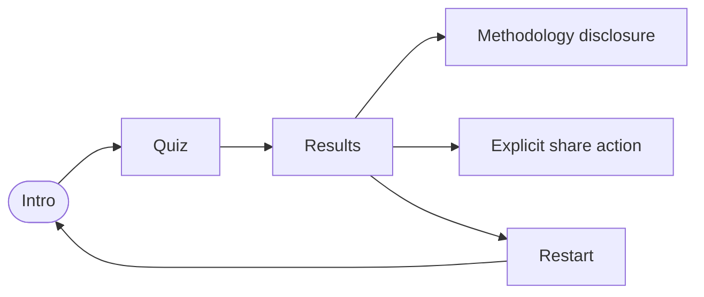

# Operation Scenarios — Ideology Layer Sorter

## 1. Roles

| Role | Description | Permissions |
|---|---|---|
| Self-explorer | Completes the local questionnaire and reads their own layered result. | Answer, revise, restart, create a local share link. |
| Methodology reviewer | Reads the public item, anchor, scoring, and source notes. | Inspect bundled methodology; no content editing in the MVP. |
| Facilitator | Uses the tool as a discussion prompt with participants. | Same as self-explorer; must explain the non-scientific framing. |

## 2. Menu and screen scenarios

### Screen: Intro

- Access role: all roles.
- Screen composition: title, three-layer explanation, non-scientific framing, methodology disclosure, start action.
- Normal flow: read the three definitions → open methodology if desired → start the 204-item flow.
- Exception flow: invalid share fragment on load → show a recoverable message → continue to intro without restoring unsafe state.

### Screen: Quiz

- Access role: self-explorer or facilitator.
- Screen composition: current layer label, current domain, prompt, optional context, six response controls, overall/current-layer progress, back/next.
- Normal flow: choose one response → advance → revise with Back if needed → cross explicit layer transition notice → complete final item.
- Exception flow: Next without response → remain on current item and announce required response. Browser refresh → answers are not automatically persisted unless a valid share link was explicitly loaded.

### Screen: Results

- Access role: self-explorer, facilitator, methodology reviewer.
- Screen composition: framing note, a gated combined pattern, three layer sections, coverage, interpretive neighbors or insufficient-information state, facet signals, cross-layer pulls, methodology/source disclosure, restart, share.
- Normal flow: read coverage first → read covered layer result or insufficiency → inspect methodology → copy or manually select a local link → restart.
- Exception flow: clipboard permission denied → show selectable link and privacy explanation. Unsupported share version → show safe recovery and return to intro.

## 3. End-to-end scenarios

### Scenario A: Full covered run

- Role: self-explorer.
- Preconditions: intro loaded; no active answer state.
- Flow: start → answer the current dataset with directional or mixed responses → final calculation → inspect the combined pattern when all three layers are covered → read the three layer sections → open source notes → copy a share link.
- Exceptions: user changes an answer with Back; calculation remains deterministic and the current answer state is preserved.
- Postconditions: results exist in memory; no answer-storage request was made.

### Scenario B: Sparse layer

- Role: self-explorer.
- Preconditions: quiz loaded.
- Flow: choose `No view yet` for at least half of one layer → answer other layers → complete.
- Exceptions: the sparse layer must show insufficient information, counts, and recovery guidance rather than an interpretive neighbor.
- Postconditions: other covered layers still render; the sparse layer remains explicitly unresolved.
- Combined-pattern condition: the combined pattern remains withheld until all three layers are covered; it never converts the sparse layer into a middle position.

### Scenario C: Facilitated discussion

- Role: facilitator and participants.
- Preconditions: facilitator explains that results are interpretive and not scientific.
- Flow: participants answer independently → each opens their own result link → group compares differences between diagnosis, values, and practice.
- Exceptions: the facilitator does not treat labels as identity verdicts or recommendations; the methodology panel is available for discussion.
- Postconditions: no answer state is transmitted to a shared server.

### Scenario D: Malformed or stale link

- Role: any user opening a copied link.
- Preconditions: URL hash is malformed, oversized, or references an unsupported dataset/policy version.
- Flow: app decodes defensively → rejects whole envelope → clears/ignores unsafe state → shows generic recovery message → intro renders.
- Postconditions: no raw fragment is echoed and no partial answer state becomes active.

## 4. Screen flow

